# Project: Divid
The primary objective of this project was to gain practical experience and expertise in mobile app development using the React Native framework.

## Tech Stack 📚

  

    
    
    
  

  

    
    
  

  

    
    
  

## About the Project 🔎
Divid is a mobile application developed using React Native, specifically optimized for Android mobile systems. This is a full-stack learning project without publication in an app store.

One of the key features of Divid is a small game that revolves around dividing numbers, hence the name "Divid." Additionally, I have implemented a store system within the application, allowing players to earn in-game rewards for completing game rounds.

In terms of functionality, Divid incorporates a Firebase backend system that includes user authentication, encompassing user registration and login capabilities. Furthermore, the application utilizes Firebase to securely collect and store users' personal data.

## Additional Information ❗
- This project is not published in an app store and, therefore, can only be accessed by locally starting the application. Additionally, to use the app, it would necessary to input the corresponding Firebase information in the firebaseConfig.js file, such as the apiKey, for example.

## Project Images 📷

  
Loading screen - The app's initial loading screen:

  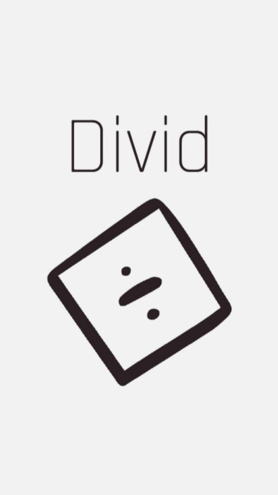

  
Start screen - Representing the start screen with a login and register option:

  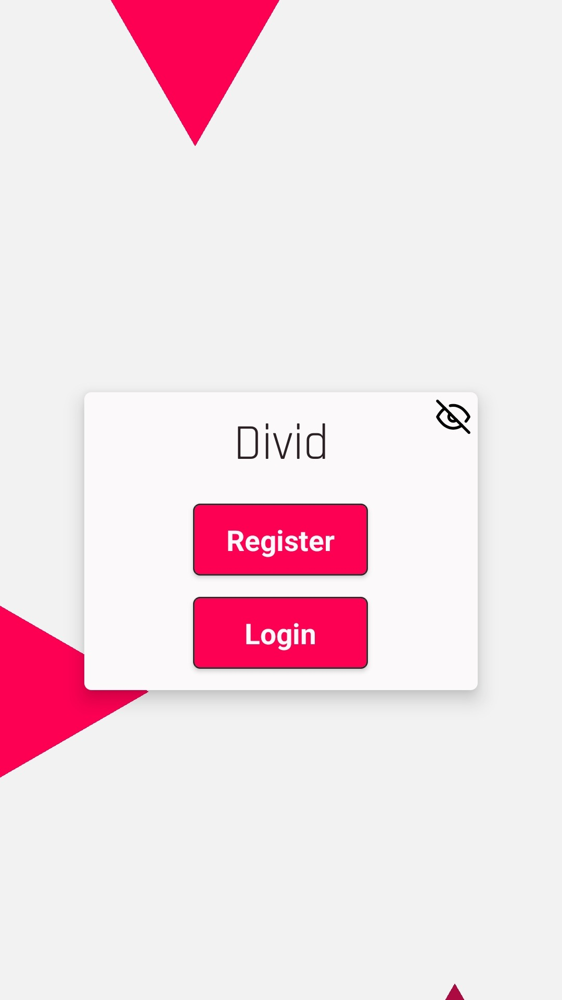

  
Registration screen - Representing the register screen:

  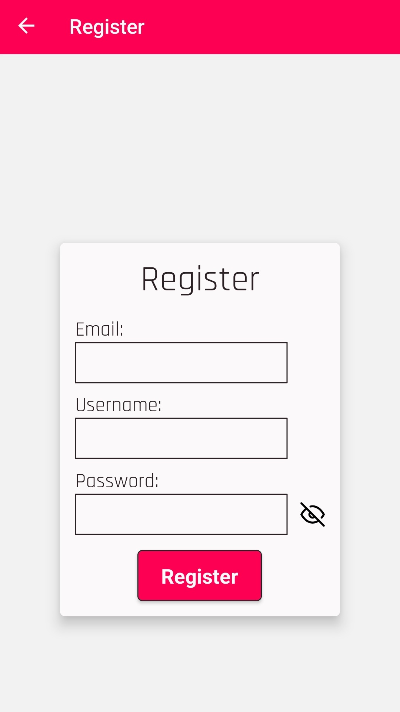

  
Login screen - Representing the login screen:

  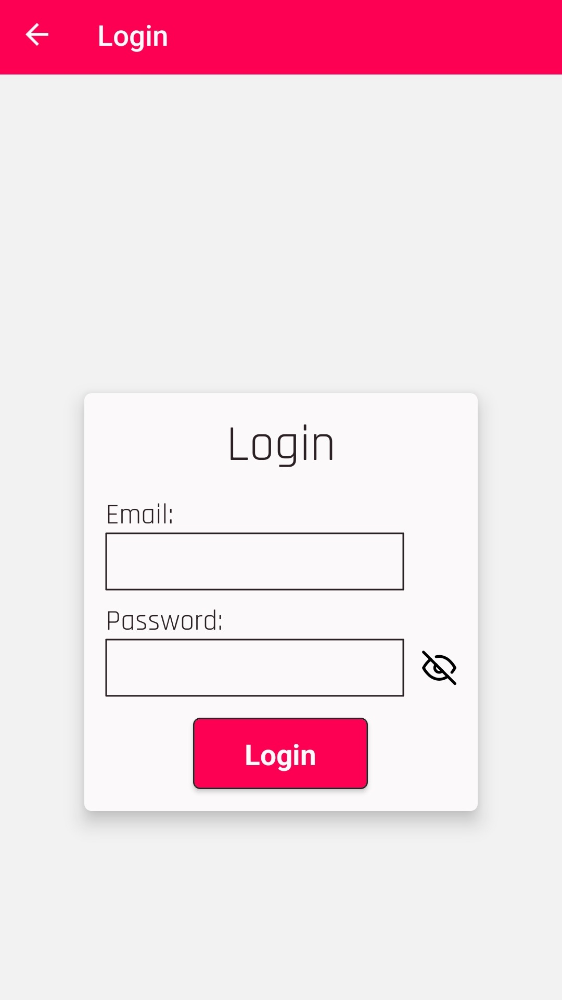

  
Home screen - Representing the home screen with the user's profile:

  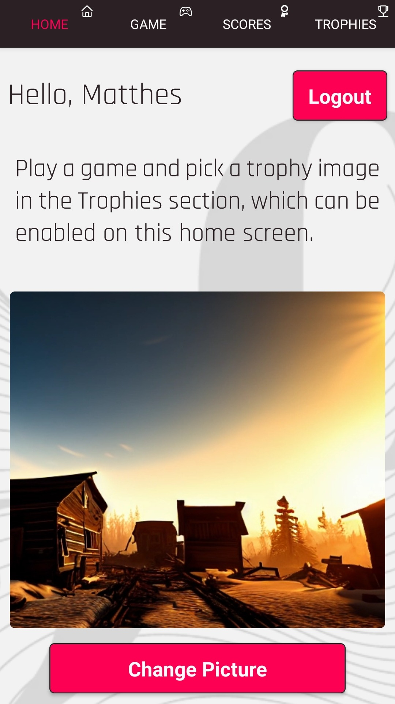

  
Change Picture screen - Representing the home screen with the user's profile and the option to change the profile picture:

  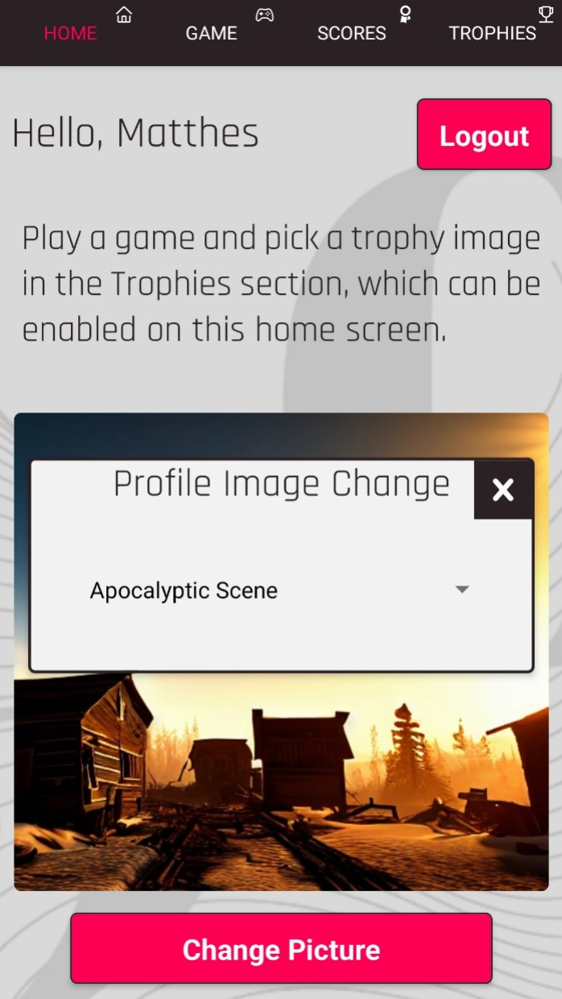

  
Gamemode selection screen - Representing the game screen where you choose the different game modes:

  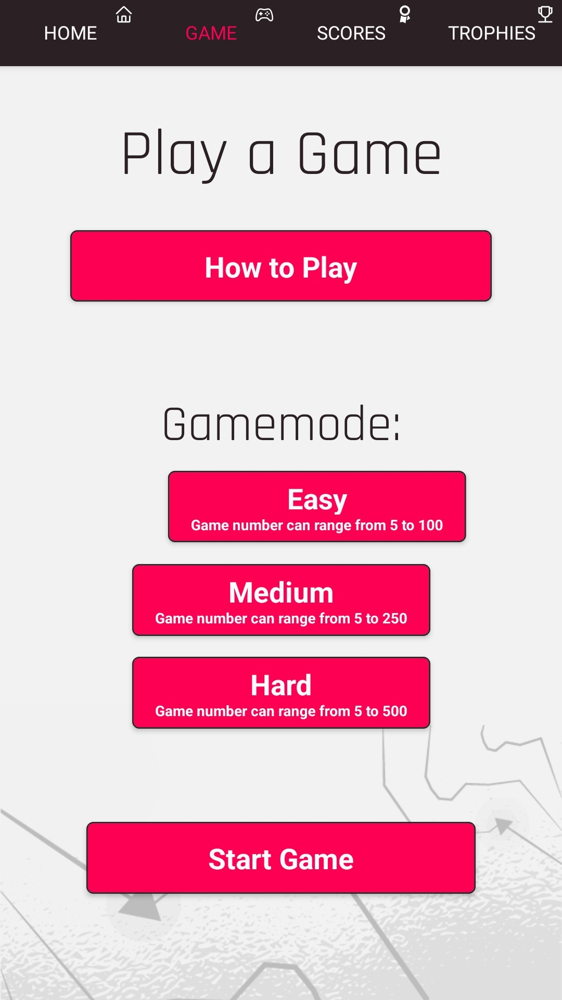

  
Instructions screen (1) - Representing the first part of the instructions for the game:

  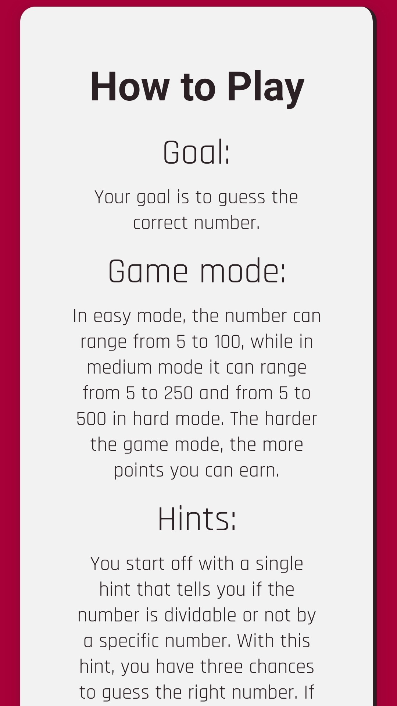

  
Instructions screen (2) - Representing the second part of the instructions for the game:

  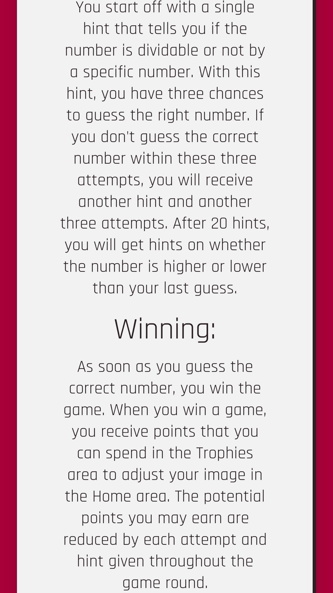

  
Game screen - Representing the game screen with an active game session:

  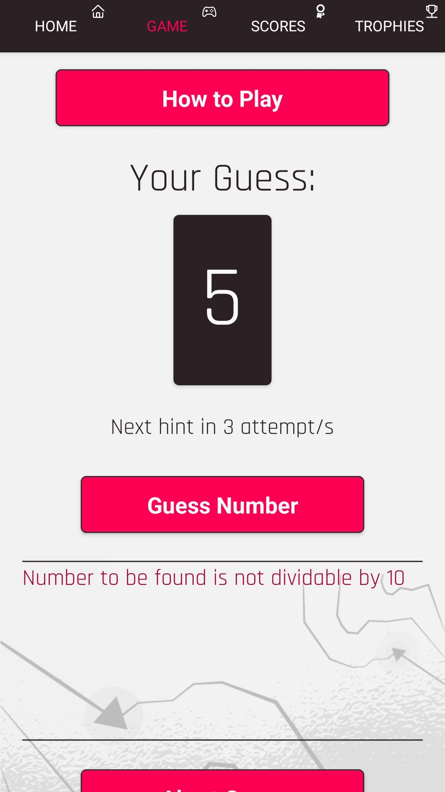

  
Scores screen - Representing the scores screen:

  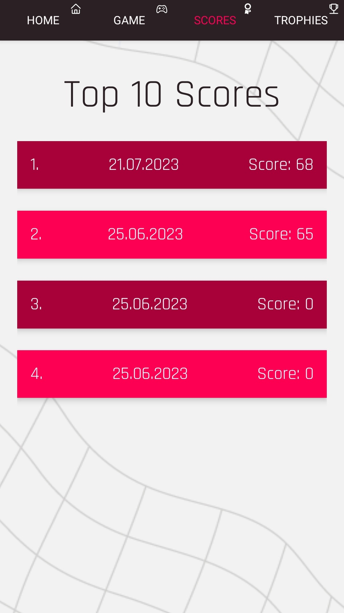

   
Store screen - Representing the store screen:

  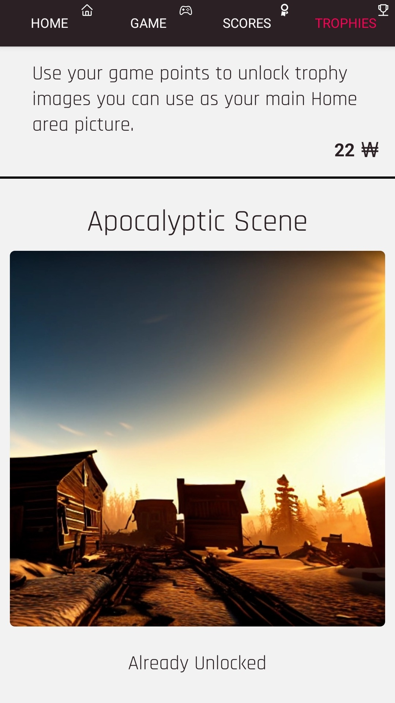

